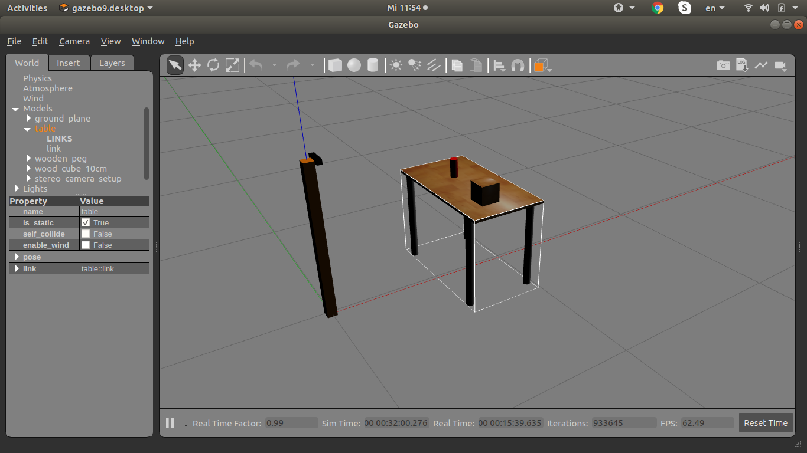
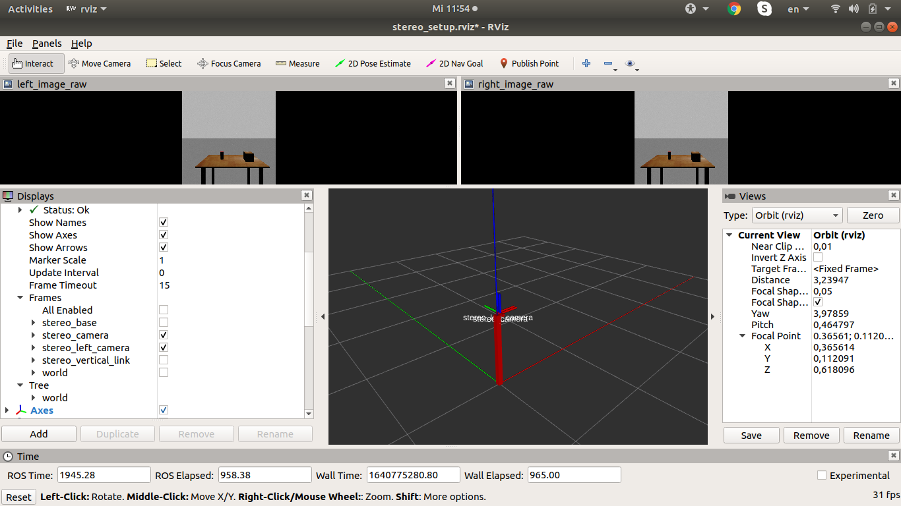
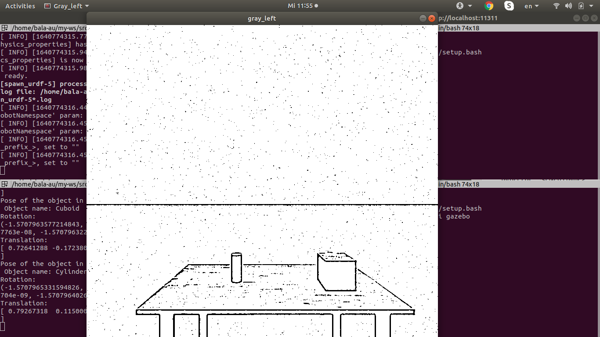
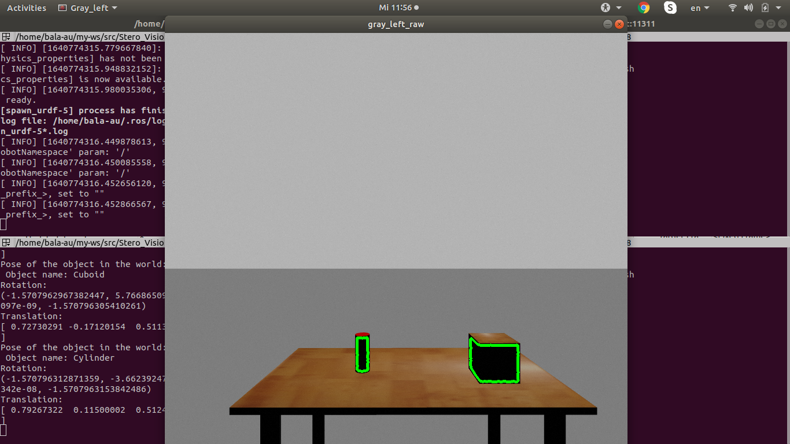
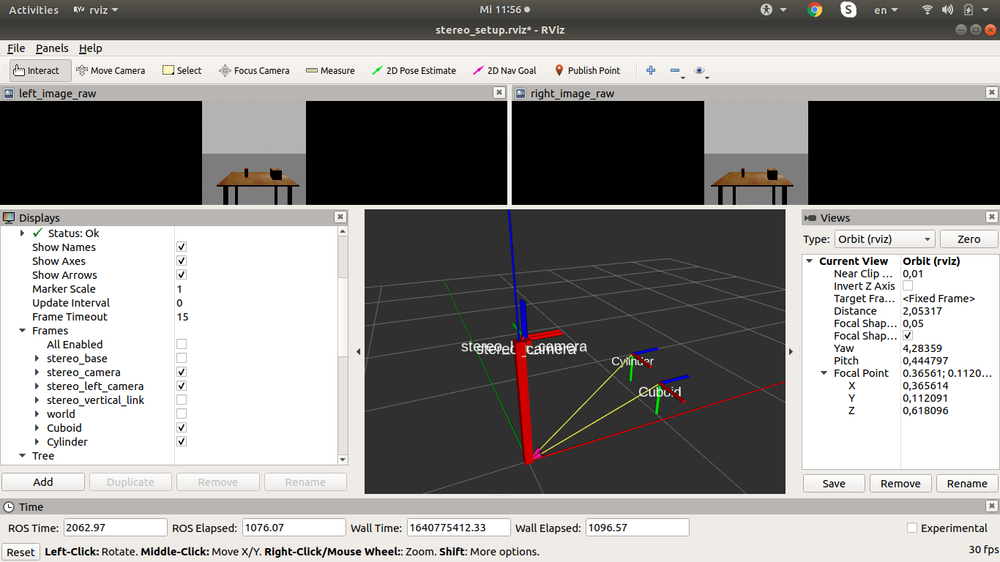

## 3D-Pose Estimation - Stereo Vision

The ROS packages that are provided in this repository are developed during the project that has been carried to determine the **3D-Pose** of the object in Gazebo with [**Stereo Vision**](https://docs.opencv.org/4.x/dd/d53/tutorial_py_depthmap.html).

### Instructions to execute the packages

All the packages in this repository are developed with [**ROS-Melodic**](http://wiki.ros.org/melodic) support and tested in **Ubuntu 18.04**. Therefore, before executing the following commands in the terminal, make sure that workspace of ros is available and built.

* **Clone the repository:**
```sh
cd ~/path_to_workspace/src
git clone https://github.com/Irudhaya/Stereo_Vision_Pose_Estimation.git
```
* **Build the workspace:**
```sh
cd ~/path_to_workspace
catkin_make
source ./devel/setup.bash
```
* **Stereo Imaging Package:**

Stereo vision is used to generate the point cloud for all the pixels in the RGB Image. In RGB image depth information is lost when the 3D points in the world coordinates is projected to the pixel coordinates. To regain the lost depth information, stereo vision is very helpful. Inorder to accomplish this two images of the same scene that are captured at the same timestamp is necessary. By calculating the disparity between the pixels of these images depth information can be retrieved. Point cloud can then be calculated from the depth information. For this project point clouds from the stereo camera is calculated from the ros node in [**stereo_image_proc**](http://wiki.ros.org/stereo_image_proc) package. Install the package with the following command,
```sh
sudo apt install ros-melodic-stereo-image-proc
```
* **Launch the Gazebo World**

The following will launch the gazebo world(simulation world), with the stereo camera setup(described as a [**URDF**](http://gazebosim.org/tutorials/?tut=ros_urdf)). Also, it will open rviz which displays the frame positions of the stereo camera setup and the left and right image seen by the stereo camera. 
```sh
roslaunch stereo_camera_description stereo_camera_description.launch
```
##### Gazebo World


##### Rviz Stereo Camera Setup


* **Launch the point cloud package**
```sh
roslaunch stereo_imaging stereo_imaging_proc.launch
```
* **Launch the pose estimation node**
```sh
roslaunch stereo_imaging stereo_imaging.launch
```
The node provided by this package will display two images, Binary and RGB image. The node detects contour of the the objects in the RGB Image. Point cloud of the object is extracted from the pixel information corresponding to the detected contours and pose of the object is estimated with [Ransac algorithm](https://docs.opencv.org/4.x/d7/d53/tutorial_py_pose.html) on camera projection model.

##### Binary Image


##### Objects Contour


In addition the node also publishes transforms of the frame of the objects and can be visualised in Rviz as follows.




